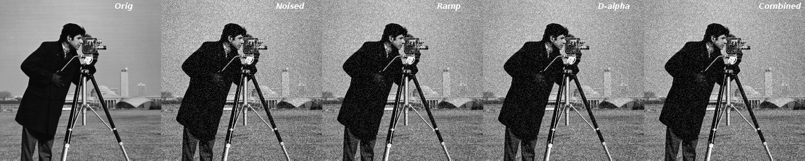

# Implementations of various papers

This repository contains my own implementation to the variety of papers. 
# Hierarchical Clustering:
- **SLINK: An optimally efficient algorithm for the single-link cluster method by R.Sibson**
- Top-down approach to the slink dendrogram as a decision tree.
- **An efficient algorithm for a complete link method by D.Defays**

# Anisotropic Diffusion Filter
- **Ramp preserving PeronaMalik model by Q. Chen, P. Montesinos, Q.S. Sun**
- **Adaptive Perona–Malik Model Based on the Variable Exponent for Image Denoising by Zhichang Guo, Jiebao Sun, Dazhi Zhang, and Boying Wu**
- Also combination of above two method is implemented.

# ToDo
- 

